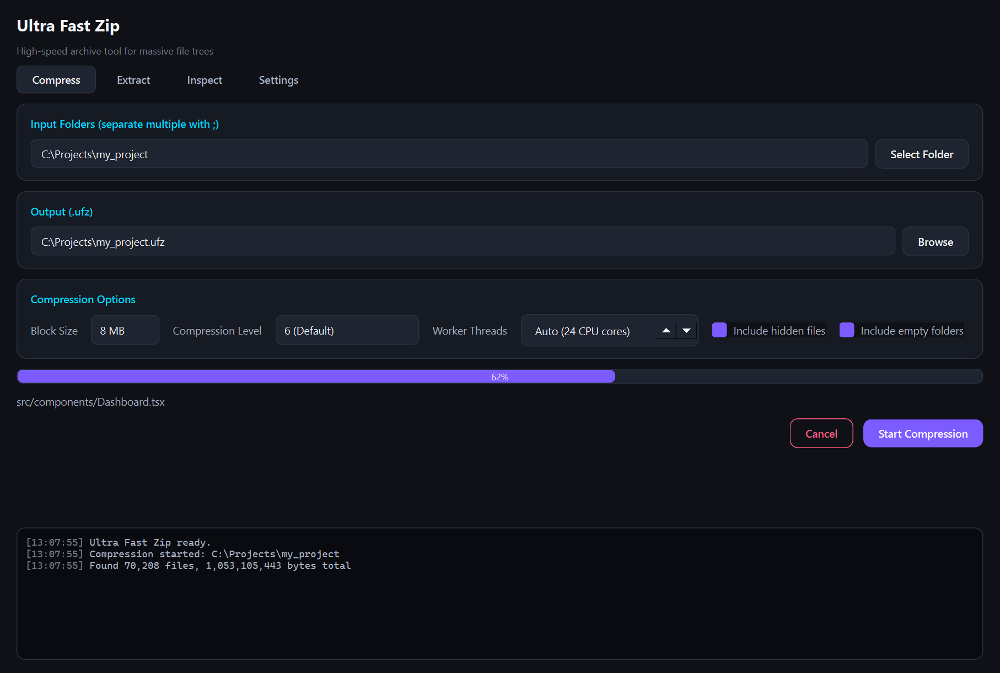
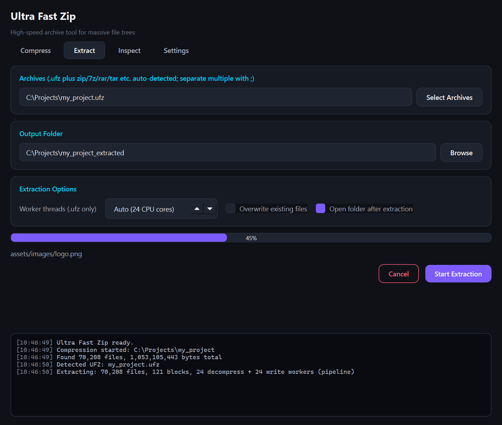
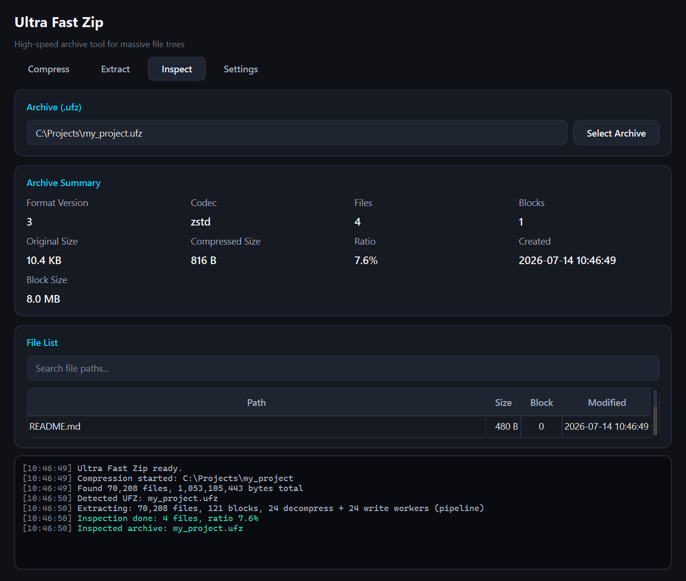
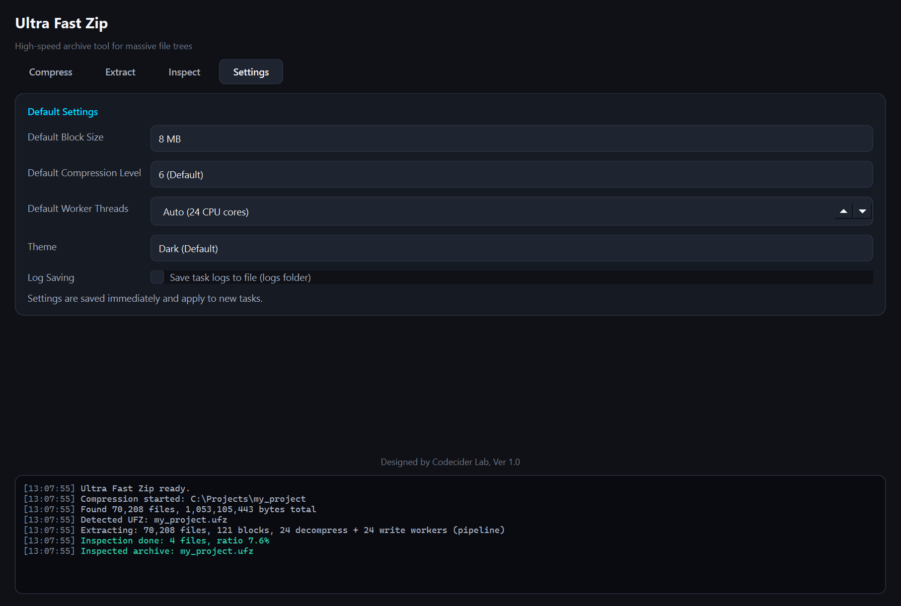

# Ultra Fast Zip

A desktop GUI + CLI tool that packs and unpacks folders with a very large
number of small files, fast. It uses its own `.ufz` format — block-based
**Zstandard** compression with xxHash64 verification — and extracts most
common archive formats via auto-detection.



## Features

- **Compress tab** — pick folders and pack them into `.ufz` (block size 1/4/8/16/32 MB,
  compression level, hidden-file/empty-folder options)
- **Extract tab** — `.ufz` archives extract through a block-parallel pipeline; other
  formats are **auto-detected by magic bytes** and extracted too:
  zip, 7z, rar, tar, tar.gz/bz2/xz/zst, gz, bz2, xz, zst, cab, iso (GUI and CLI alike)
- **Inspect tab** — file/block counts, sizes, ratio, creation time, searchable file list
- **Settings tab** — default block size / level / threads, optional file logging
- Progress bar + color log console, dark theme; work runs on QThread workers so the
  GUI never freezes
- Zip Slip (path traversal) protection and dual block/file checksums on every extract
- Legacy `.fpk` archives (the format's previous name) remain fully readable

## Installation

Requires Python 3.11+.

### Windows (quick start)

```powershell
setup.bat        # creates .venv and installs dependencies
```

Then run `UltraFastZip.bat` (GUI) or `ufz.bat` (CLI).

### Manual (all platforms)

```bash
python -m venv .venv
# Windows: .venv\Scripts\activate   |   macOS/Linux: source .venv/bin/activate
pip install -r requirements.txt
```

## GUI

```bash
python app/main.py        # or UltraFastZip.bat / UltraFastZip.exe
```

A dark-themed desktop app with four tabs. Work runs on background QThread
workers, so the window stays responsive; the progress bar, current-file line,
and color log console update live, and every job can be cancelled mid-run.
All options are saved as you change them and restored on the next launch.

| Tab | What it does |
|-----|--------------|
| **Compress** | Pick one or more folders (Ctrl/Shift multi-select, or `;`-separated paths) and pack each into a `.ufz` archive. Block size (1–32 MB), compression level (1–22), and hidden-file/empty-folder options per job. |
| **Extract** | Select archives of any supported format — the type is detected from file content, not the extension. `.ufz` extracts via the parallel pipeline with a configurable thread count; overwrite protection is on by default, and the output folder can auto-open when done. |
| **Inspect** | Instant `.ufz` archive summary (version, codec, sizes, ratio, creation time) plus a searchable file list — read from the header without decompressing anything. |
| **Settings** | Defaults for block size / level / threads, theme, and optional file logging (`logs/ufz_*.log`). |

<details>
<summary>More screenshots (Extract / Inspect / Settings)</summary>





</details>

See the [user manual](docs/manual.html)
([PDF](docs/UltraFastZip_UserManual.pdf)) for a full walkthrough.

## Run the CLI

The CLI needs no PySide6 — standard library plus zstandard/xxhash only.

```bash
# Pack a folder (default output: <folder>.ufz)
python app/cli.py pack my_folder
python app/cli.py pack my_folder -o backup.ufz --block-size 16 --level 9 --overwrite

# Extract (default output: <name>_extracted) — format auto-detected
python app/cli.py unpack backup.ufz
python app/cli.py unpack backup.ufz -o restore_dir --threads 8 --overwrite
python app/cli.py unpack photos.zip        # zip/7z/rar/tar/gz/cab/iso also work

# Archive info / file list
python app/cli.py inspect backup.ufz
python app/cli.py inspect backup.ufz --list
```

Key options:

| Command | Option | Description |
|---------|--------|-------------|
| pack | `--block-size MB` | Block size (1/4/8/16/32, default 8) |
| pack | `--level 1-22` | Zstandard level (default 6) |
| pack | `--no-hidden` / `--no-empty-dirs` | Exclude hidden files / empty folders |
| unpack | `-t, --threads N` | Worker threads (.ufz only, default 0 = CPU count) |
| unpack | `--overwrite` | Overwrite existing files |
| common | `-q, --quiet` | Suppress progress/logs |

### Supported extraction formats (auto-detected)

| Format | Backend | Notes |
|--------|---------|-------|
| `.ufz` (incl. legacy `.fpk`) | Native parallel pipeline | Pack + unpack |
| zip | Python stdlib | cp949 filename recovery, Zip Slip guarded |
| tar, tar.gz/bz2/xz/zst | stdlib + zstandard | Streaming, progress supported |
| gz, bz2, xz, zst (single file) | stdlib + zstandard | `foo.txt.gz` → `foo.txt` |
| 7z | py7zr (if installed) or bsdtar | |
| rar, cab, iso | bsdtar (libarchive) | Bundled with Windows 10+/macOS |

Packing (creation) is `.ufz` only. Path traversal is blocked on every
extraction path.

## Documentation

- **User manual**: [docs/manual.html](docs/manual.html)
  (PDF: [docs/UltraFastZip_UserManual.pdf](docs/UltraFastZip_UserManual.pdf)) —
  GUI walkthrough with screenshots, CLI reference, format spec, troubleshooting
- **Format comparison / benchmarks**: [docs/format_comparison.md](docs/format_comparison.md)
- **Development history**: [DEVELOPMENT.md](DEVELOPMENT.md)

## Tests

```bash
pip install pytest
python -m pytest tests -v
```

## Benchmarks

Measured against mainstream archivers — 7-Zip 26.02 and WinRAR 7.23, each at
its normal preset — on i9-12900K (16C/24T) / NVMe SSD / Windows 11. Every
restored tree was verified against the source by full CRC32 (all PASS); each
job ran twice and the minimum was taken.

**Mixed dataset — 4,412 files / 322 MB** (source code, JSON, logs, binaries, media):

| Tool / format | Pack | Unpack | Ratio |
|---------------|-----:|-------:|------:|
| **UFZ** (zstd-6, this project) | 2.1s | **0.7s** | 17.0% |
| ZIP (7-Zip, deflate `-mx5`) | **1.5s** | 2.0s | 18.6% |
| 7z (7-Zip, LZMA2 `-mx5`) | 28.9s | 1.8s | **14.2%** |
| RAR (WinRAR, `-m3`) | 3.2s | 1.7s | 17.0% |
| tar.zst (bsdtar, zstd-6) | 1.5s | 1.2s | 16.8% |

**Real-world data — 1,000 JPEG photos / 812 MB** (already-compressed media):

| Tool / format | Pack | Unpack | Ratio |
|---------------|-----:|-------:|------:|
| **UFZ** (zstd-6, this project) | 6.9s | **0.9s** | 78.9% |
| ZIP (7-Zip) | **3.8s** | 3.3s | 79.3% |
| 7z (7-Zip) | 21.3s | 2.5s | **76.1%** |
| RAR (WinRAR) | 7.9s | 2.3s | 77.5% |
| tar.zst (bsdtar) | 5.4s | 0.8s | 79.0% |

Takeaways:

- **Extraction is where UFZ leads**: fastest of every tool tested on both
  datasets — 2.3–3.8× faster than ZIP/7z/RAR — thanks to the block-parallel
  pipeline. The gap grows with core count.
- Packing is currently single-threaded, so multithreaded ZIP packs faster;
  a parallel pack pipeline is on the roadmap. UFZ still out-compresses ZIP
  and matches RAR on ratio at a fraction of 7z's pack time.
- ARJ and LZH were not measured: both are legacy formats with no maintained
  creation tools (7-Zip and bsdtar can only extract them).

Full analysis in [docs/format_comparison.md](docs/format_comparison.md);
reproduce with `scripts/bench_gen_dataset.py` + `scripts/bench_major.py`
(tar-family comparison: `scripts/bench_multi.py`).

## Building executables

```powershell
build.bat
```

Outputs:

- `dist\UltraFastZip\UltraFastZip.exe` — GUI (onedir)
- `dist\ufz.exe` — CLI (onefile, no PySide6, small)

Manual build:

```bash
pip install pyinstaller
pyinstaller --noconsole --name UltraFastZip --paths . app/main.py
pyinstaller --onefile --console --name ufz --paths . app/cli.py
```

Add `--icon assets/icon.ico` for the Windows icon.

## Extraction pipeline architecture

`.ufz` extraction is a producer/consumer pipeline where reading,
decompression, and writing all overlap:

```text
Archive (mmap, zero-copy reads)
    |
Block Queue          <- block map built instantly from metadata, sequential order
    |
Decompress Worker xN <- block checksum verify + Zstandard decompress
    |                   (backpressure via 256MB in-flight memory budget)
Write Queue
    |
Writer Worker xN     <- per-file checksum verify + write
    |
Disk
```

Key optimizations:

- **mmap zero-copy reads** — compressed data reaches workers as memoryview slices
- **Pipeline parallelism** — N decompress + N write workers connected by queues
- **Memory budget** — a semaphore caps in-flight decompressed blocks at 256 MB
- **xxHash64 checksums (format v3)** — several times faster than CRC32
- **Directory cache** — all folders created once up front; the write stage only writes files
- **Tiny-file packing** — hundreds of small files decompress as one block and are
  split in memory (a property of the format design)
- **Sequential layout** — files are stored in sorted path order, so extraction reads
  and writes sequentially
- **FIFO dispatch** — workers pull the next block from a shared queue, so no CPU idles
- **SIMD** — Zstandard/xxHash C libraries use AVX2 etc. internally

## .ufz format

```text
Header
  MAGIC            8 bytes   UFZ1\0\0\0\1  (legacy FPK1\0\0\0\1 readable)
  VERSION          uint16    (little-endian)
  METADATA_LENGTH  uint64
Metadata JSON (UTF-8)
Block Header #1   RAW_SIZE uint64 | COMPRESSED_SIZE uint64 | XXH64 uint64
Compressed Block #1 (zstd)
Block Header #2
Compressed Block #2
...
```

- Files are grouped into fixed-size blocks before compression. Both the block
  checksum (compressed data) and per-file checksums (original data) are verified.
- Version history: v1 = zlib + CRC32, v2 = Zstandard + CRC32,
  v3 (current) = Zstandard + xxHash64. All older versions (including `.fpk`)
  remain extractable.
- Every extracted path is confined to the output folder (traversal-safe).

## Directory layout

```text
app/
  main.py          # GUI entry point
  cli.py           # CLI entry point
  ui/              # PySide6 UI (tabs, theme)
  core/            # format/pack/unpack/detection logic (GUI-independent)
  workers/         # QThread workers
  utils/           # path/format/log utilities
tests/             # pytest suite
scripts/           # icon generation, benchmarks
```

## Contact

- Bug reports and feature requests: please open a
  [GitHub issue](https://github.com/codeciderluke/ultra-fast-zip/issues)
- Other inquiries: **codecider.luke@gmail.com**

## License

MIT License — see [LICENSE](LICENSE).
Third-party notices: [NOTICE.md](NOTICE.md).
